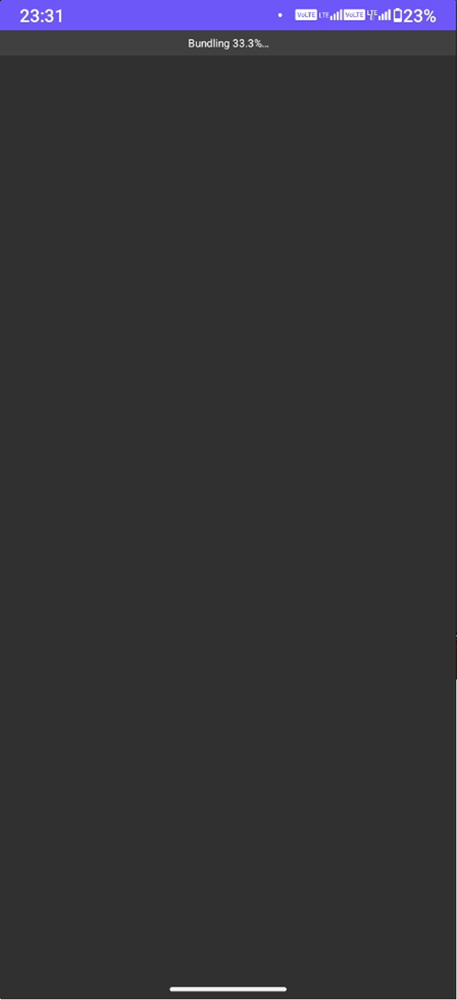
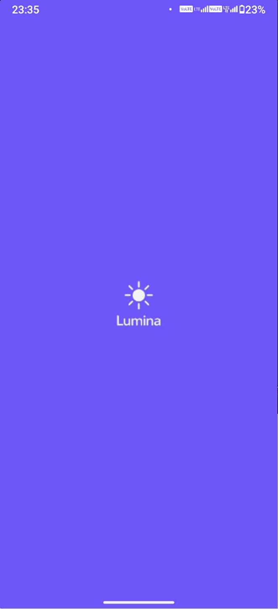
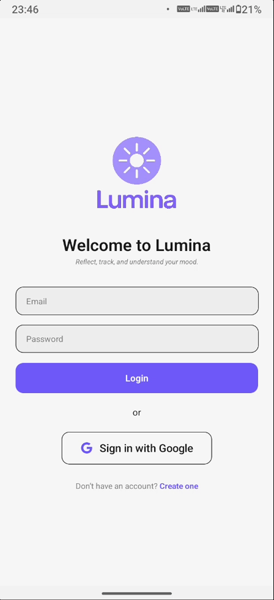
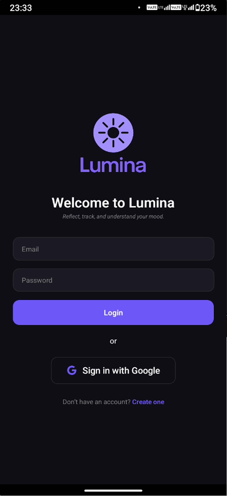

# 🌙 Lumina – Daily Mood Journal App

**Lumina** is a simple and calming mood journaling app that helps you track your emotions, triggers, and habits to better understand your mental well-being.

Built with **Expo**, **React Native**, and **Zustand**, Lumina combines a soothing interface with useful insights to support your daily self-reflection practice.

---

## ✨ Features

- 📝 **Daily Mood Logging** – Record how you feel in seconds
- 🔄 **Trigger & Habit Tracking** – Identify patterns over time
- 📊 **Mood Analytics** – Visualize your emotional trends
- 🌗 **Light & Dark Mode Support**
- 🔔 **Daily Reminders** – Stay consistent with gentle prompts
- 📱 **Minimal, Reflective Design** – A calm space for your thoughts
- 🔓 **Google Sign-In** – One-tap access using Google
- 📬 **Email Verification** – Confirm identity before full access
- 🚨 **Push Notifications** – Stay engaged with reminders and insights

---

## 📷 Screenshots




### 🌞 Light Mode



### 🌙 Dark Mode



---

## 🚀 Getting Started

### 1. Clone the Repository

```bash
git clone https://github.com/your-username/lumina-daily-mood-journal.git
cd lumina-daily-mood-journal
```

### 2. Install Dependencies

```bash
npm install
# or
yarn
```

### 3. Start the App

```bash
npx expo start
```

## 🧪 Sample `.env`

```env
EXPO_PUBLIC_GOOGLE_AUTH_CLIENT_ID=your-google-client-id.apps.googleusercontent.com
EXPO_PUBLIC_API_URL=https://your-production-backendend.com || http://192.168.x.x:${BACKEND_PORT}(for development)
```

---

## 🫱‍♂️ Tech Stack

- [Expo](https://expo.dev/) (React Native)
- Zustand (State Management)
- React Navigation (Expo Router)
- Expo Image / Font / SplashScreen
- Expo Notifications (Upcoming)

---

## 📁 Project Structure

```
.
├── app/                 # Screens & Routes (expo-router)
├── assets/              # Fonts, images, and icons
├── components/          # Reusable UI components
├── config/              # Configurations for External Providers (Notifications, Toast Messages etc.)
├── constants/           # Constant Values (Colors, BlurHash for expo image etc.)
├── hooks/               # Renders hooks for app usage (useColorScheme, usePushNotifications etc.)
├── providers/           # Generate Context for the app (NotificationProvider etc.)
├── screenshots/         # Stores Snapshots of the application
├── store/               # Zustand store (mood, habits, users etc.)
├── utils/               # Utility functions (types)
├── app.json             # App config (splash, icon, etc.)
├── eas.json             # EAS Build for production, development and preview
└── tsconfig.json        # Typescript Configurations
```

---

## 🔧 Utils Overview

- `utils/types.ts` – # Types for Users, Moods etc

---

## 🎈 Theming

Lumina supports both **light** and **dark** modes using custom `ThemedText`, `ThemedView`, and `ThemedTextInput` components:

```ts
/components / Themedtx.tsx / components /  ThemedTextInput.tsx  / components /ThemedView.tsx;
```

---

## 📦 Key Dependencies

```json
"expo": "~50.x",
"expo-router": "^3.x",
"expo-splash-screen": "~0.20.x",
"expo-font": "~11.x",
"expo-image": "^1.x",
"expo-notifications": "~0.20.x",
"zustand": "^4.x",
"react-native-reanimated": "~3.x",
```

---

## 🔒 License

MIT License © 2025 Boluwatife Yomi-Olugbodi

---

> Lumina is your daily space to reflect, understand, and grow — one mood at a time.
